## To run:
```bash
uv run -m src.main --methods hough hough_prob --transforms abs clip normalize resize nlm median clip normalize --output output.jpg --start-time '09:22:22' --end-time '09:24:12' --group-lines hough_prob=true,hough=true,all=true --cluster --polynomial
```

# Report
In this project, we aimed to detect and group line segments in DAS recordings. The main steps of the algorithm include preprocessing the input data, detecting line segments using Hough Transform methods, grouping the detected segments, and clustering them based on their characteristics.

## Project structure
I used `uv` to manage dependencies and run the project. I structured the project, so that it's modular and easy to modify. I implemented a few base classes, like `Method` class for line detection methods, or `Transform` class for preprocessing transforms, so that new methods and transforms can be added easily. 

I also used a `.yaml` configuration file to store all parameters of the algorithms, so that it's easy to change them without modifying the code.

The `main.py` script runs all the steps of the algorithm, and saves the output visualization to a file. It uses the `argparse` library to dynamically select different preprocessing transforms, line detection methods, grouping methods, and clustering options.

```
├── README.md                 # This file
├── pyproject.toml            # Project configuration file
├── src
│   ├── clustering.py         # Clustering similar lines
│   ├── config.yaml           # All parameters of the algorithms
│   ├── get_data.py           # Creating a dataframe from DAS recordings
│   ├── group_lines.py        # Line grouping methods
│   ├── hough_method.py       # Standard Hough method
│   ├── hough_prob_method.py  # Probabilistic Hough method
│   ├── main.py               # Main script to run the algorithms
│   ├── method.py             # Base class for line detection methods
│   ├── transforms.py         # Different preprocessing transforms
│   └── visualize.py          # Visualization utilities
└── uv.lock
```
## Earlier attempts

We've tried multiple different preprocessing methods, line detection algorithms, and grouping strategies before settling on the current approach. Here is some a brief overview of the earlier attempts:

### Preprocessing
We've implemented multiple different preprocessing transforms, including:
- Absolute value transform
- Normalization (to [0, 1] range)
- Clipping (to remove extreme values)
- Z-score normalization
- Median filtering
- Total variation denoising
- Non-local means denoising
- Resizing (to reduce computational load)
- Morphological operations

The best results were achieved using a combination of absolute value transform, clipping, normalization, resizing, non-local means denoising and median filtering.

Here are some examples of ealier preprocessing attempts:

**Basic transforms:**
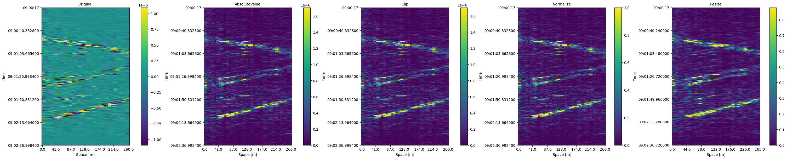

**Morphological transforms:**
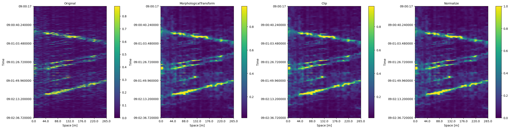

**Z-score transform:**
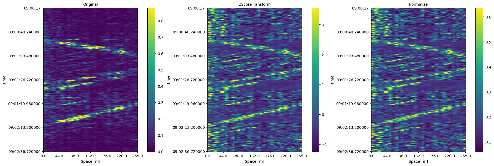

**Total variation denoising:**
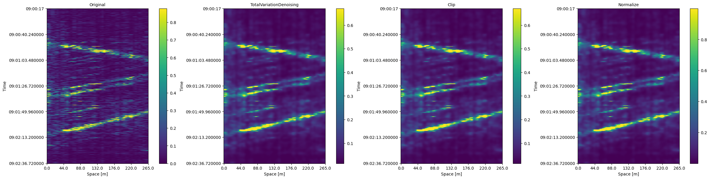

### Line detection
We experimented with two line detection methods: Standard Hough Transform and Probabilistic Hough Transform. Both methods were able to detect line segments in the preprocessed DAS data, but we found that the Probabilistic Hough Transform was able to detect thiner lines, whereas the Standard Hough Transform was better at detecting longer lines, therefore we combined both of them in our final algorithm.

### Line grouping
We experimented with multiple different line grouping strategies, and multiple strategies for combining the line segments together. All of our approaches were based on using HDBSCAN clustering algorithm to cluster the line segments based on their characteristics, and then averaging the clusters together. We tried a few different distance metrics for HDBSCAN, including:
- Calculating the shortest distance between a line endpoint and another line, and averaging them toget.
- Calculating a weighted average of the angle between the lines, and the distance between their midpoints.
- Sampling some points along the lines, and clustering the points together.

And we tried multiple different strategies for averaging the line segments together, including:
- Finding the intersection points of the lines and the image borders, and averaging those points together.
- Fitting a linear regression model to the sampled points along the lines.
- Fitting a polynomial regression model to the sampled points along the lines.

## Statistics
In this section, we analyze some statistical features of the DAS data. 

We performed a Fast Fourier Transform (FFT) on the signals from the DAS sensors, for each channel separately:
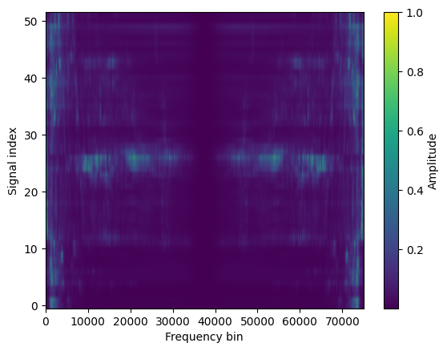

Here, we also calculated the gradient along the spatial axis (i.e., along the fiber length) to see how the signal changes between neighboring sensors:

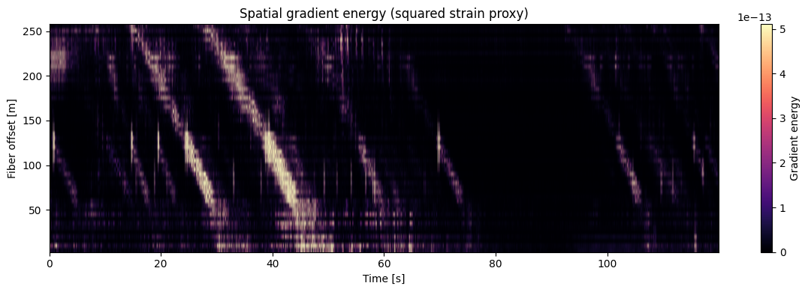

Here, we used the FFT results to calculate the center of mass (centroid) of the frequency spectrum for spatial locations along the fiber:
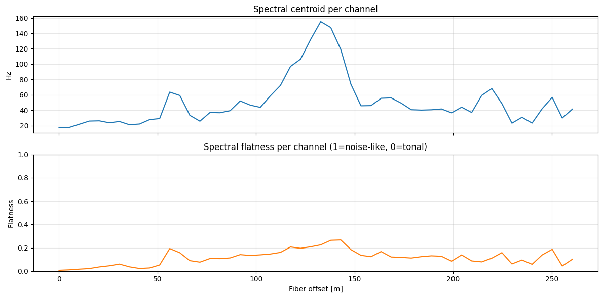


Here, we calculated the spectral flatness, i.e. the difference between the tallest spike in FFT compared the rest of the spectrum. We also calculated the band energy in low, mid, and high frequency ranges, which is the "share" of signal energy in those frequency bands:
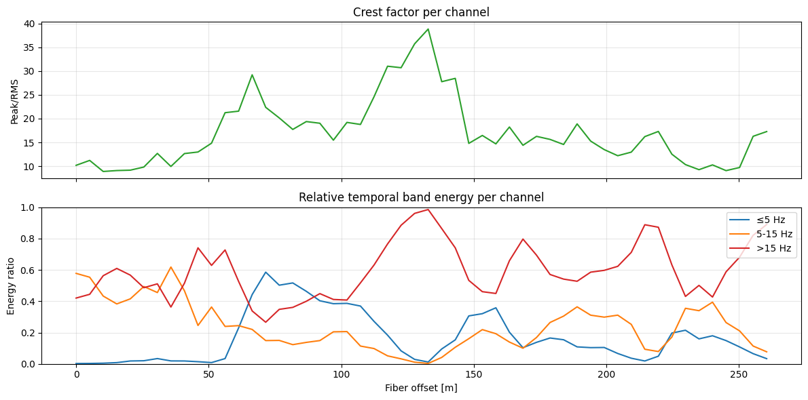


## The algorithm
The best results we achieved were using the following preprocessing stack:
- Absolute value transform
- Clipping
- Normalization
- Resizing
- Non-local means denoising
- Median filtering
- Clipping and Normalization (again)

We also combined the standard and probabilistic Hough Transform methods for line detection, since they both detected different types of lines well. 

To group the detected line segments, we sampled points along the line segments, and used HDBSCAN clustering algorithm to cluster those points together. Then we used a linear/polynomial regression model to fit to those points and extract lines. 

We applied line grouping three times: first to group lines detected by the standard Hough Transform (with a linear regression model), then to group lines detected by the probabilistic Hough Transform (linear regression), and finally to group all the detected lines together (with a polynomial regression model). 

After calculating the final set of lines, we used the k-means algorithm to cluster the lines based on the sets of points that were used to fit the regression models for those lines.

The k-means algorithm extracted:
- the number of sampled points per line
- the mean of the sampled x-coordinates
- the mean of the sampled y-coordinates
- the standard deviation of the sampled x-coordinates
- the standard deviation of the sampled y-coordinates

as features for clustering.

### Block diagram
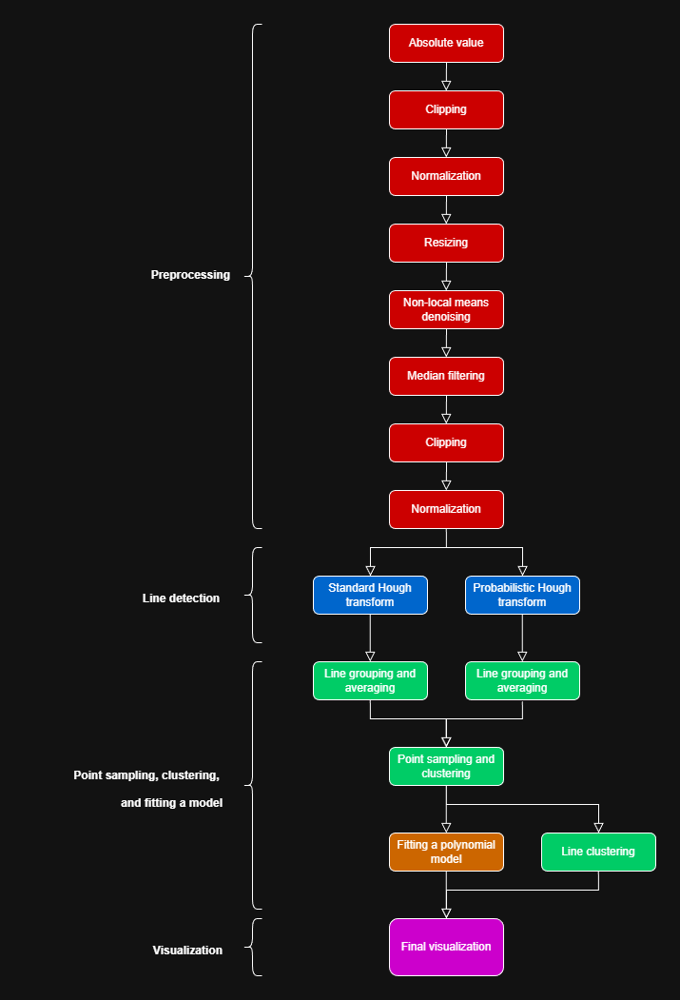

## Results

Here are the final visualizations we achieved with the algorithm:

### 09:05:52 - 09:07:42
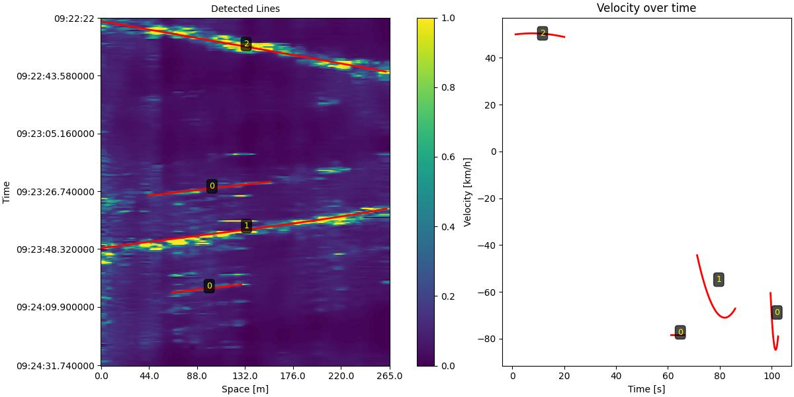
### 09:07:42 - 09:09:32
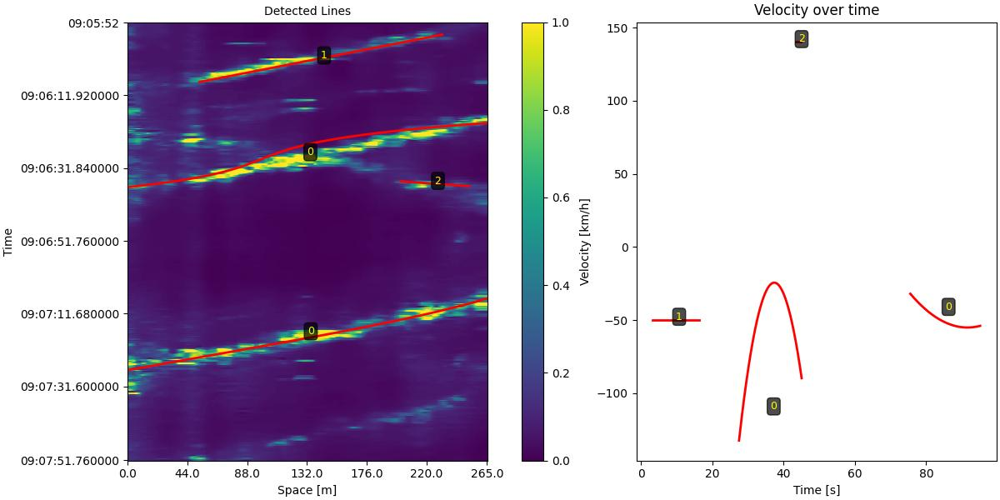
### 09:40:52 - 09:42:42
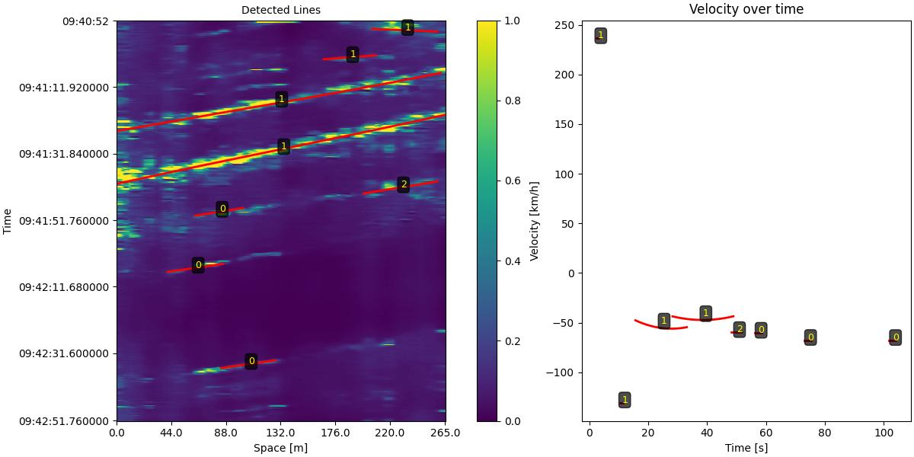
